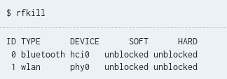

# Instalar Arch "fácil"

## Particiones

Tener dos particiones ya hechas:
- 500 MB -> Para la partición de /boot
- 50 GB -> Para el resto

## USB booteable

- Descargar la iso de [Arch](https://archlinux.org/download/).
- Descargar [Rufus](https://rufus.ie/es/).

Lo siguiente es quemar la iso en una USB minimo de 8G.

- Abrir Rufus
- Seleccionar la iso y la USB.
- Aceptar TODO.

## Iniciar USB 

- Reiniciar la computadora con la USB conectada.
- Antes de encender completamente, presionar F12 para abrir el Windows Boot Manager.
- Seleccionar la USB.

## Teclas

Para cambiar la configuración del teclado a español.

```
loadkeys es
```
## Red

Por defecto no tendremos conexión a internet y para comprobar podemos usar el siguiente comando.

```
ping 8.8.8.8
```

y no tendremos respuesta.

Muchas computadoras portátiles tienen un botón (o interruptor) de hardware para apagar la tarjeta inalámbrica; sin embargo, el kernel también puede bloquear la tarjeta. 

Para ver el estatus de nuestros dispositivos inalámbricos podemos usar el siguiente comando.

```
rfkill
```
 


