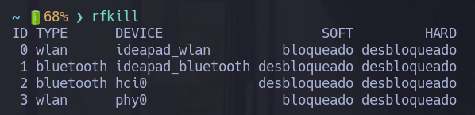

# Instalar Arch "fácil"

## Particiones

Tener dos particiones ya hechas:

- 500 MB -> Para la partición de /boot
- 50 GB -> Para el Sistema operativo

Las particiones se pueden hacer desde la **administración de discos** en Windows.


## USB booteable

- Descargar la iso de [Arch](https://archlinux.org/download/).
- Descargar [Rufus](https://rufus.ie/es/).

Lo siguiente es quemar la iso en una USB minimo de 8G.

- Abrir Rufus
- Seleccionar la iso y la USB.
- Aceptar TODO.


## Iniciar USB 

- Reiniciar la computadora con la USB conectada.
- Antes de encender completamente, abrir el Windows Boot Manager. (Presionar F12)
- Seleccionar la USB.


## Teclas

Para cambiar la configuración del teclado a español.

```
loadkeys es
```
## Tarjeta de red

Por defecto no tendremos conexión a internet y para comprobar podemos usar el siguiente comando para verificar que no tendremos respuesta.

```
ping 8.8.8.8
```


Muchas computadoras portátiles tienen un botón (o interruptor) de hardware para apagar la tarjeta inalámbrica; sin embargo, el kernel también puede bloquear la tarjeta. 

Para ver el estatus de nuestros dispositivos inalámbricos podemos usar el siguiente comando:

```
rfkill
```
 

Podemos ver que nuestra tarjeta wifi esta bloqueada y para desbloquear usamos el siguiente comando:

```
rfkill unblock wifi
```

y podemos volver a a verificar el estatus de nuestros dispositivos inalámbricos para comprobar que estan desbloqueados.


## Red

Para conectarnos a una red wifi vamos a utilizar una herramienta llamada **iwctl**

Debemos conocer dos cosas para conectarnos a internet:

- EL SSID (Nombre de nuestra de red)
- El password de la red

Para conectarnos usamos el siguiente comando:

```
iwctl --passphrase CONTRASEÑA_RED station wlan0 connect NOMBRE_RED
```

> En dado caso que nuestro nombre de red tenga caracteres especiales como por ejemplo: guiones, signos, etc.
>
> El nombre debe de ir entre comillas: "NOMBRE_RED"

Para verificar que ya contamos con internet mandamos un ping y esta vez tendremos respuesta.

```
ping 8.8.8.8
```


## Instalación 

Para instalar fácilmente Arch Linux podemos usar el instalador que tiene incluida la iso.

Usamo el siguiente comando:

```
archinstall
```

